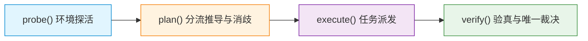

# Panqu AI DevTest

面向 Panqu AI 图片与视频生成链路的轻量纯净测试副驾、端到端质量工程与自动化验收框架。源码版本为 **v5.4.0**，统一由一套纯 TypeScript 内核驱动，以完全同源逻辑提供本地终端 CLI 与 IDE 辅助 TRAE MCP 双入口。

| 核心属性 | 当前规范与工程事实 |
| --- | --- |
| **版本 / 包名** | `test-flow@5.4.0` |
| **运行时要求** | Node.js `>=20` · TypeScript `>=5.9` · ESM 纯模块 |
| **双模同源入口** | 本地终端 `devtest` CLI (`bin/devtest-cli.ts`) · IDE 辅助 `devtest-mcp` (`bin/devtest-mcp.ts`) |
| **四大核心动作** | `probe()` 环境探活 · `plan()` 分流推导 · `execute()` 任务派发 · `verify()` 验真对账 |
| **唯一裁决引擎** | `CanonicalVerdictEngine`：基于 Canonical TestSpec 与统一证据信封的单裁决权威（纯三态：`PASS` \| `FAIL` \| `UNVERIFIED`） |
| **E2E 闭环能力** | 支持 `--wait` / `wait: true`：`execute` 自动桥接 `verify` 完成全链路验收 |
| **测试验证矩阵** | **33 个测试套件 · 606 项单元测试全部通过 (100% PASS)** |
| **架构规范** | 严格遵守 [`docs/ARCHITECTURE_FREEZE.md`](docs/ARCHITECTURE_FREEZE.md) 核心语义冻结与受控扩展架构，零中心上帝类，零虚假大盘 |
| **发布形式** | GitHub 源码快照与 Trae MCP 配置对齐；真实环境执行必须显式提供合法凭据 |

---

## 目录 (Table of Contents)

1. [项目定位与定位边界](#1-项目定位与定位边界)
2. [核心架构与设计原则](#2-核心架构与设计原则)
3. [核心执行链路](#3-核心执行链路)
4. [核心能力的真实实现与行为](#4-核心能力的真实实现与行为)
5. [E2E 闭环 (--wait 与 wait: true)](#5-e2e-闭环---wait-与-wait-true)
6. [PASS 判定规则与黄金预期](#6-pass-判定规则与黄金预期)
7. [异步任务状态机与超时语义](#7-异步任务状态机与超时语义)
8. [CLI 使用方式](#8-cli-使用方式)
9. [MCP 使用方式](#9-mcp-使用方式)
10. [Session 与鉴权体系](#10-session-与鉴权体系)
11. [产物校验规范与边界](#11-产物校验规范与边界)
12. [计费对账规范与边界](#12-计费对账规范与边界)
13. [测试覆盖与质量门禁](#13-测试覆盖与质量门禁)
14. [架构冻结说明与演进边界](#14-架构冻结说明与演进边界)
15. [项目目录结构](#15-项目目录结构)
16. [版本与发布记录](#16-版本与发布记录)

---

## 1. 项目定位与定位边界

### 1.1 Panqu DevTest 是什么
Panqu DevTest 是专门针对 Panqu AI 多模态图片生成与视频生成业务链路设计的轻量、纯净、无副作用的测试工程副驾。它提供从环境可用性探测、多渠道分流推导、测试任务受控提交，到二进制物理产物深度解构、线上积分账单对账和金融安全不变量审计的全流程质量门禁体系。

### 1.2 解决什么问题
- **多渠道路由歧义**：厘清并验证模型调用是走 Direct 渠道还是 NewAPI 智能网关分流，消除模型与渠道混淆，防止路由配置错误。
- **异步长链路不可靠**：生视频等任务属于耗时异步任务，DevTest 建立带网络抖动容忍与指数退避的终态轮询监视器。
- **虚假产物与损坏逃逸**：杜绝“HTTP 状态码 200 即代表生成成功”的假象，深入解析容器文件二进制头尾 Box 结构。
- **账务资损与超扣漏洞**：核实扣费流水与定价基准的一致性，防止重复扣费以及任务失败未全额退款等资损事故。
- **调用者单方声明伪造**：杜绝入参手工声明 `gatewayChannelConfirmed=true` 绕过核验，缺少只读网关快照采集器时严格阻断。
- **智能体可靠性与假 PASS 逃逸**：提供内建的 Agent 可信度评测引擎，拦截假 PASS、证据遗漏、ID 混淆与虚构资源调用。

### 1.3 服务对象是谁
- **AI 研发工程师**：用于在本地或开发机快速自测模型适配情况与路由分流策略。
- **QA 质量与测试专家**：用于编写回归用例、执行黑盒与灰盒验收测试、建立持续集成质量门禁。
- **自动化 CI/CD 流水线**：作为代码合并与发布前的自动化质量关卡（Gate）。
- **IDE 辅助智能体 (如 Trae / Cursor)**：通过标准 Model Context Protocol (MCP) 为智能体提供可靠的测试动作心智模型。

### 1.4 为什么必须是“只测不跑”
> [!IMPORTANT]
> **只测不跑 (Test Orchestration & Quality Gate Only) 是 DevTest 的永久边界与立身之本。**

DevTest 负责**测试编排、质量门禁、物理证据链验真、验收闭环**，坚决**不承载模型训练与推理服务本身**。
1. **职责分离**：模型权重加载、GPU 算力调度与并行推理是 Panqu AI 核心模型服务的职责；DevTest 保持轻量纯 TypeScript，无需昂贵的深度学习运行时环境。
2. **纯净无副作用**：除显式指定 `mode=real` 且提供合法授权会话时向测试环境发起标准测试任务外，所有探活、规划与验真操作严格 100% 只读，绝对禁止修改生产数据库或干扰线上运行状态。
3. **可信客观性**：测试框架必须作为客观独立的裁判员，不能既当运动员又当裁判员。

---

## 2. 核心架构与设计原则

### 2.1 五层分层架构拓扑

系统严格遵循单核同源的分层架构拓扑与受控扩展标准：

```text
┌────────────────────────────────────────────────────────────────────────┐
│                   呈现层 (Presentation Layer)                          │
│        本地终端 CLI (devtest)       │    IDE 辅助 MCP (devtest-mcp)     │
└────────────────────────────────────┬───────────────────────────────────┘
                                     │ 共享调用
                                     ▼
┌────────────────────────────────────────────────────────────────────────┐
│                     内核层 (Core Kernel Layer)                         │
│                          core-kernel.ts                                │
│       ┌──────────────┬──────────────┬──────────────┬──────────────┐    │
│       │   probe()    │    plan()    │  execute()   │   verify()   │    │
│       └──────┬───────┴──────┬───────┴──────┬───────┴──────┬───────┘    │
│              │              │              │              │            │
│              │              │              │ 收集原生事实  ▼            │
│              │              │              │   buildCanonicalEvidence  │
│              │              │              │   构建 CanonicalTestSpec  │
└──────────────┼──────────────┼──────────────┼──────────────┼────────────┘
               ▼              ▼              ▼              ▼
┌────────────────────────────────────────────────────────────────────────┐
│                     编排层 (Orchestrator Layer)                        │
│   env-probe      routing      media-flow    media-inspector   billing  │
│   domain-knowledge   requirement-trace   result-sink   ui-adapters     │
│   agent-evaluation   execution-ports     legacy-protocol-mappers       │
└────────────────────────────────────┬───────────────────────────────────┘
                                     │ 统一不可变证据信封汇聚
                                     ▼
┌────────────────────────────────────────────────────────────────────────┐
│                      门禁层 (Gate Layer)                               │
│       CanonicalVerdictEngine (唯一裁决引擎) · Canonical Evidence       │
│   纯三态裁决 (PASS | FAIL | UNVERIFIED) · 门禁阻断 (UNVERIFIED + blocker) │
│   Fail-Closed 原则 · 四维物理证据链 · 三大金融安全不变量 · 零假 PASS 判定  │
└────────────────────────────────────┬───────────────────────────────────┘
                                     │ 单向兼容投影
                                     ▼
┌────────────────────────────────────────────────────────────────────────┐
│                兼容投影层 (Compatibility Projection Layer)             │
│   projectCanonicalVerdictToLegacy() -> status / verdict / acceptance   │
│   (acceptance: ACCEPTED | REJECTED | BLOCKED | UNVERIFIED)             │
└────────────────────────────────────────────────────────────────────────┘
```

1. **呈现层 (Presentation)**：CLI 终端 (`bin/devtest-cli.ts`) 与 Trae MCP 服务 (`bin/devtest-mcp.ts`) 完全同源，调用逻辑 100% 保持一致。
2. **内核层 (Core Kernel)**：`src/devtest/core-kernel.ts`。统一驱动四大核心动作，杜绝中心化上帝类。
3. **编排层 (Orchestrator)**：单一职责的领域模块集合，包含探活、路由消歧、媒体执行流、物理结构解析、账务对账、需求追溯、结果导出与智能体评测。
4. **门禁层 (Gate)**：收口于 `CanonicalVerdictEngine`，执行强类型确定性断言核验与金融不变量审计，凡证据链不完整或不变量被违背，一票否决阻断通过。
5. **兼容投影层 (Compatibility Projection)**：`legacy-protocol-mappers.ts`。负责将 Canonical 纯三态裁决单向映射为旧版 CLI/MCP 兼容结构。

### 2.2 核心设计原则
- **严格遵守架构冻结**：完全遵循 [`docs/ARCHITECTURE_FREEZE.md`](docs/ARCHITECTURE_FREEZE.md)，严禁擅自新增第 5 个核心动作或上帝编排器。
- **受控适配器扩展原则 (Controlled Adapter Extension Rules)**：核心领域语义冻结，仅允许通过标准端口（`ExecutionAdapter` / `EvidenceProducer`）挂载可选适配器。
- **唯一裁决引擎权威 (Single Verdict Engine)**：适配器只负责执行或采集证据，绝对不拥有最终裁决权；所有最终判定均由 `CanonicalVerdictEngine` 统一收口。
- **当前拓扑与未来拓扑严格界定**：当前仅 `verify()` 完整接入 Canonical Evidence 与 Verdict Engine；`probe()`, `plan()`, `execute()` 作为领域支撑编排模块，输出原生领域事实，不具备最终裁决权。
- **黄金预期必填红线 (Mandatory Golden Expectation)**：测试规范中的 `goldenExpectation` 必须显式必填，严禁从 legacy 结果或当前 verify 结果反推。缺少黄金预期直接判定失败（Fail-Closed），杜绝假 PASS。
- **证据前置，事实第一**：一切结论以物理字节切片与真实账单流水为依据，拒绝主观臆断。
- **Fail-Closed (防逃逸闭门)**：任何网络超时、接口异常、账单缺漏或调用者单方声明未核验情况，默认裁决为 `UNVERIFIED` + blocker，投影为 `BLOCKED`，绝对禁止默认放行。
- **零副作用原则**：只读操作绝不产生写网络调用或落库修改；真实执行受到环境、模式与预算的多重门禁保护。

---

## 3. 核心执行链路

系统具备严密的端到端执行链路，环环相扣，数据流转清晰：



| 环节 | 核心输入 | 核心输出 | 领域依赖 | 阶段约束 |
|---|---|---|---|---|
| **`probe`** | 环境目标 (`env`)、会话文件 (`sessionFile`)、超时阈值 (`timeoutMs`)、仿真标志 (`mock`) | 网关健康状态、Session 有效性与脱敏凭据、模型白名单与能力画像 | `env-probe.ts` | 严格只读；原生 `EnvProbeReport`，无裁决权 |
| **`plan`** | 模型 ID (`modelId`)、媒体类型 (`mediaType`)、分辨率 (`resolution`)、时长 (`duration`)、提示词 (`prompt`)、渠道与目标消歧入参 | 分流决策 (Direct / NewAPI)、候选渠道、基准积分预算 (`expectedPoints`)、测试用例计划、消歧结果 | `routing.ts`<br>`domain-knowledge.ts` | 纯内存推导；原生 `PlanKernelResult`，预算标为 `DEVTEST_EXPECTATION`，无裁决权 |
| **`execute`** | 模型与媒体参数、执行模式 (`mock` / `real`)、授权会话 (`sessionFile`)、闭环等待标志 (`wait`)、渠道消歧参数、执行适配器 (`executionAdapter`) | 任务编号 (`taskId`)、执行状态 (`SUBMITTED`/`SUCCESS`/`BLOCKED`)、预扣积分 (`points`)、仿真标记 (`isSimulated`) | `media-flow.ts`<br>`routing.ts`<br>`execution-ports.ts` | 原生 `ExecuteKernelResult`，无裁决权；`mode=real` 需合法会话；`wait=true` 自动桥接至 `verify` |
| **`verify`** | 任务 ID (`taskId`)、模型规格、产物 URL (`videoUrl`)、预期基准积分、轮询超时阈值 (`pollTimeoutSec`) | 4D 证据审计报告、三大金融安全不变量状态、Canonical 裁决结果 (`passed`)、生产验收结果 (`acceptance`) | `canonical-verdict-engine.ts`<br>`media-inspector.ts`<br>`billing.ts` | 唯一全接入 Canonical 协议与 Verdict Engine 的核心动作；缺证据则 Fail-Closed |

---

## 4. 核心能力的真实实现与行为

### 4.1 `probe()`：环境探活与能力发现
- **网络与服务连通性**：对测试或预发环境主站网关发起轻量探活，获取网关可用状态。
- **Session 状态感知**：加载并验证凭证的有效性，若已失效则提示重新授权。
- **模型白名单与能力画像**：获取系统支持的模型 ID 集合，解析每个模型支持的分辨率（如 720p, 1080p）、生成时长（如 4s, 5s）与媒体类型。
- **裁决权边界**：无裁决权，产出原生 `EnvProbeReport`。探活成功仅代表连通性良好，不代表下游业务验收通过。

### 4.2 `plan()`：契约构建、消歧与分流推导
- **目标对象消歧 (`disambiguateTarget`)**：严格区分模型目标（modelId / alias）、网关渠道目标（channelId / channelName）以及场景目标，防止混淆。
- **业务分流决策**：基于模型配置特征，自动推导出应采用 Direct 直连模式还是 NewAPI 网关分流，并列出可用渠道 (`candidateChannels`)。
- **成本预算推导**：结合时长、分辨率及刊例计算推导预扣积分基准值（标明为 `DEVTEST_EXPECTATION`，防伪装成真实流水）。
- **风控与参数防御**：基于领域知识库（`domain-knowledge.ts`）检查提示词敏感词风险、比例参数合法性与失效模式预警（FP-001 ~ FP-005）。
- **裁决权边界**：无裁决权，产出原生 `PlanKernelResult`。推导基准仅为核验期望，绝非业务裁决事实。

### 4.3 `execute()` 与 `executeCanonical()`：受控派发与标准端口
- **真实网络提交 (`mode: 'real'`)**：
  - 必须提供合法的 `sessionFile`（或由 `autoSession` 自动解析成功）。
  - 视频生成提交接口：`POST /aivideo/v2/generate/video`
  - 图片生成提交接口：`POST /aivideo/v2/generate/submit_picture_custom_size`
  - 返回真实的服务端异步任务 ID 与预扣积分。
- **受控离线仿真 (`mode: 'mock'`)**：
  - 离线生成模拟任务 ID（带有明确 `simulationId` 且 `isSimulated: true`），完全不发起外部网络请求，适用于本地回归与 CI 校验。
- **标准执行端口 (`execution-ports.ts`)**：
  - 支持注入实现 `ExecutionAdapter` 契约的标准适配器（如 `PanquMediaExecutionAdapter`）。
  - `executeCanonical` 提供符合 CanonicalTestSpec 输入与 ExecutionResult 输出的标准 Canonical 接口。
- **裁决权边界**：无裁决权。任务提交成功（例如 HTTP 200 或分配 task_id）绝不等于业务验证 PASS。

### 4.4 `verify()`：5D 事实汇聚、唯一裁决与兼容投影
- **事实汇聚**：驱动领域支撑模块采集 5 维原生事实（Task 终态、Artifact 归属、Media 容器物理结构、Billing 扣费流水、Invariants 金融不变量）。
- **信封构建**：通过 `buildCanonicalEvidenceFromVerifyFacts` 将 verify 事实转换为统一不可变 `CanonicalEvidenceEnvelope[]`。
- **TestSpec 构建**：由 `core-kernel.verify()` 根据当前验收场景直接构建不可变 `CanonicalTestSpec`。
- **唯一裁决引擎收口**：调用 `CanonicalVerdictEngine.evaluateCanonicalVerdict` 进行终审，产出纯三态裁决 (`PASS` | `FAIL` | `UNVERIFIED`)，门禁阻断统一表示为 `UNVERIFIED + blocker`。
- **兼容投影**：通过 `projectCanonicalVerdictToLegacy()` 投影为包含 status / verdict / acceptance (`ACCEPTED` / `REJECTED` / `BLOCKED` / `UNVERIFIED`) 的回执。

### 4.5 智能体可信度离线评测引擎 (`agent-evaluation.ts`)
- **定位**：对使用本框架或执行测试编排的外部智能体（Agent）进行离线可信度评测。
- **评测输入**：智能体真实输出样本（包含 `structuredDecision`、`toolCalls` 等）、黄金评测标准（`goldenCriteria`）。
- **8 维核心漏洞检测**：
  1. `FALSE_PASS` (假 PASS)：在基线要求未满足时宣称 PASS；
  2. `EVIDENCE_OMISSION` (证据遗漏)：缺失基线必需证据或遗漏断言字段；
  3. `ID_CONFUSION` (ID 混淆)：混淆 Task ID、Channel ID 或 Model ID；
  4. `FALLBACK_MISJUDGMENT` (降级误判)：未授权降级或将降级误判为正常；
  5. `PRICING_UNKNOWN` (定价未知)：在定价未明确时擅自执行扣费操作；
  6. `OFFLINE_MASQUERADING_REAL` (仿真冒充)：用离线/仿真数据冒充真实执行；
  7. `UNAUTHORIZED_SIDE_EFFECT` (未授权副作用)：违反只读策略产生外部写调用；
  8. `FICTITIOUS_RESOURCE` (虚构资源)：调用未在已知白名单内的虚构端点或资源。
- **指标与判定**：输出假 PASS 率、证据遗漏率、ID 混淆率。**任一假 PASS 立即导致评测整体失败 (CRITICAL)**。

### 4.6 需求与变更追溯矩阵 (`requirement-trace.ts`)
- **稳定需求标识**：提供 `isStableRequirementId` 校验规则，支持规范化需求 ID（如 `REQ-202609-01`、`BUG-9527`）。
- **双向索引构建**：`buildRequirementTraceIndex` 建立需求与 TestSpec 的映射矩阵，快速识别未覆盖需求与失效用例。
- **影响分析与覆盖缺口**：`analyzeImpact` 接收变更文件、影响模型或渠道列表，精确推导受波及的测试范围与覆盖缺口 (`CoverageGap`)。

### 4.7 多端结果导出与 Sink 契约 (`result-sink.ts`)
- **标准化记录映射**：`mapVerdictToExportRecord` 将 `CanonicalVerdictResult` 及证据信封转换为标准化导出结构。
- **解耦接口定义**：定义 `ResultSink` 统一契约，支持将测试事实导出至标准化监控大盘、外部审计平台或日志归档系统，杜绝在核心内核中硬编码特定外部依赖。

### 4.8 多模态 UI 适配器契约与切片提取 (`ui-adapters.ts`)
- **标准证据生产端口**：实现 `UIBrowserEvidenceProducer` 与 `UIVisualAiEvidenceProducer`，提供 DOM 事实、网络拦截事实与视觉辅助事实的标准化信封采集。
- **PNG 物理尺寸安全提取**：`readPngDimensions` 直接读取 PNG IHDR 块解析像素宽高，零外部依赖，杜绝空指针。
- **确定性时间戳注入**：所有适配器均支持外部注入 `capturedAt` 与 `evidenceId`，完全消除测试运行中的非确定性随机数与时间戳漂移。

---

## 5. E2E 闭环 (--wait 与 wait: true)

DevTest 在 CLI 和 MCP 中均完整打通了全自动连续闭环流水线：

```text
[execute 开始] ───► 任务提交 (POST generate)
                         │
                         ▼ (获得 taskId)
[verify 自动桥接] ──► 终态轮询 (pollTaskStatus)
                         │
                         ▼ (任务状态到达终态)
                    产物切片验真 (inspectMedia)
                         │
                         ▼ (解析 ftyp/moov/mdat)
                    账务流水对账 (queryTaskBillingLogs + BillingOracle)
                         │
                         ▼ (审计 3 大金融不变量)
                    CanonicalVerdictEngine 统一裁决
                         │
                         ▼ (强类型断言裁决)
[完成输出] ───────► 输出全维技术裁决与生产验收报告
```

### 5.1 `wait: false` vs `wait: true` 语义对比

| 特性 / 行为 | `wait: false` (非阻塞异步模式) | `wait: true` / `--wait` (全链路闭环模式) |
|---|---|---|
| **默认状态** | CLI 与 MCP 调用的默认行为 | 显式声明 `--wait` 或 `wait: true` |
| **返回时机** | 服务端返回任务创建回执后立即返回 | 必须等待任务完成终态轮询、产物解析与账单对账后返回 |
| **返回状态** | 状态为 `SUBMITTED` 或 `SUCCESS`（仅代表提交成功） | 返回全维裁决 `ALL PASS`、`FAILED`、`UNVERIFIED` 或 `PROCESSING` |
| **安全提示** | 附带显式警示：**“任务未到达终态，严禁判定为测试通过，必须调用 verify”** | 给出完整的四维物理证据明细与生产验收结论 |
| **适用场景** | 批量任务派发、异步作业解耦调度 | 端到端单测、CI/CD 阻塞式流水线门禁、IDE 智能体自主验收 |

---

## 6. PASS 判定规则与黄金预期

### 6.1 核心裁决判定公式
> [!IMPORTANT]
> 系统最终技术裁决由 `CanonicalVerdictEngine` 严格执行：
> $$\text{Final Verdict} = \text{Task SUCCESS} \land \text{Artifact PASS} \land \text{Billing PASS} \land \text{Invariants PASS}$$

只有当且仅当以下全部条件同时满足时，最终裁决才允许判定为 **PASS**（或 `ALL PASS`）：
1. **Task SUCCESS**：异步任务成功到达业务成功终态（无服务端报错或超时）。
2. **Artifact PASS**：媒体物理文件存在、可下载，且二进制容器结构完整（包含合法签名、完整 Box 拓扑及有效音视频轨）。
3. **Billing PASS**：账单扣费记录严格等于 1 条、扣费积分与推导基准吻合。
4. **Invariants PASS**：三大金融安全不变量（防重复扣费、失败净扣归零、退款幂等）全部满足。

### 6.2 黄金预期必填红线 (Mandatory Golden Expectation)
- **严格显式指定**：所有回归与金标测试规范必须显式提供 `goldenExpectation`。
- **禁止反推推导**：严禁从 `legacyNormalizedVerdict`、兼容投影结果或当前 `verify` 执行回执反向推导黄金期望。
- **缺少黄金预期立即失败**：凡缺少黄金预期的测试用例直接判定失败（Fail-Closed），绝对禁止自证循环。

### 6.3 缺证据时的 Fail-Closed 规则
- 缺少任意一项有效凭据，一律**禁止默认通过**。
- 若网络抖动或未授权导致无法获取真实账单流水（如 `SKIPPED_NO_LOGS`），系统技术裁决严格标记为 `UNVERIFIED`，生产验收严格标记为 `BLOCKED`。
- **禁止调用者声明升级**：入参单方传入 `gatewayChannelConfirmed=true` 属于 `USER_ASSERTION`，在缺少真实只读网关快照采集器时，严格判定为 `BLOCKED_MISSING_TRUSTED_COLLECTOR`，坚决不放行。

---

## 7. 异步任务状态机与超时语义

### 7.1 状态转移矩阵

```text
       ┌─────────────┐
       │  SUBMITTED  │
       └──────┬──────┘
              │ (轮询监控)
              ▼
       ┌─────────────┐
   ┌───┤ PROCESSING  ├───┐
   │   └──────┬──────┘   │
   │          │          │
   ▼          ▼          ▼
SUCCESS     FAILED     ERROR
 (成功)      (失败)     (异常)
```

1. **`SUCCESS`**：服务端已完成媒体生成，产物 URL 已暴露且合法。
2. **`FAILED`**：业务明确失败（如 Prompt 触发平台合规拦截、生成超时熔断）。
3. **`ERROR`**：系统级故障、鉴权失效或网络不可达。
4. **`PROCESSING / QUEUED` (超时阻断)**：轮询窗口已耗尽但服务端状态仍处于排队或处理中。

### 7.2 超时 Fail-Closed 原则
- 当轮询达到设定超时阈值（`pollTimeoutSec`，默认 180 秒）仍未到达终态时，系统**绝不伪造 PASS 或 FAILED**。
- 状态严格输出为 `PROCESSING`，裁决为 `UNVERIFIED`，验收状态为 `BLOCKED`，明确报告“轮询窗口已耗尽，非业务终态，需人工跟进或延长超时重新轮询”。

---

## 8. CLI 使用方式

### 8.1 命令概览
```bash
# 查看全局帮助与命令列表
node dist/bin/devtest-cli.js --help

# 四大核心动作命令帮助
node dist/bin/devtest-cli.js probe --help
node dist/bin/devtest-cli.js plan --help
node dist/bin/devtest-cli.js execute --help
node dist/bin/devtest-cli.js verify --help
```

### 8.2 常用实战命令示例

```bash
# 1. 环境探活 (受控离线仿真)
node dist/bin/devtest-cli.js probe --env test --mock

# 2. 真实环境探活 (加载凭据文件)
node dist/bin/devtest-cli.js probe --env test --session-file /path/to/session.json

# 3. 动态规划与分流推导 (图片模型)
node dist/bin/devtest-cli.js plan --model 25 --media image

# 4. 动态规划与分流推导 (视频模型，指定分辨率与时长，输出纯净 JSON)
node dist/bin/devtest-cli.js plan --model 84 --media video --resolution 720p --duration 4 --json

# 5. 受控仿真执行 (启用 --wait 全链路闭环)
node dist/bin/devtest-cli.js execute --model 84 --media video --mode mock --wait

# 6. 真实环境执行与全链路闭环 (包含终态轮询、切片物理验真、账单对账)
node dist/bin/devtest-cli.js execute \
  --model 84 \
  --media video \
  --mode real \
  --session-file /path/to/session.json \
  --resolution 720p \
  --duration 4 \
  --wait \
  --poll-timeout 180

# 7. 独立对已有任务进行 4D 证据验真
node dist/bin/devtest-cli.js verify \
  --task 12345 \
  --model 84 \
  --media video \
  --session-file /path/to/session.json

# 8. 结合产物 URL 进行直接物理切片验真
node dist/bin/devtest-cli.js verify \
  --task 12345 \
  --model 84 \
  --media video \
  --video-url "https://cdn.example.com/outputs/task12345.mp4"
```

### 8.3 输出格式
- **终端格式化输出 (默认)**：人类可读的彩色三段式实战回执（🎯 概况 · 🔍 验真 · 💻 复现）。
- **纯净 JSON 输出 (`--json`)**：不混杂任何 ANSI 转义符或装饰文本，专供 CI/CD 脚本自动化解析与指标上报。

---

## 9. MCP 使用方式

DevTest 原生提供符合 Model Context Protocol (2024-11-05) 标准的 stdio 通讯服务，赋能 Trae 等 IDE 智能体。

### 9.1 为什么必须保持四大核心动作
DevTest MCP 严格只对外暴露以 `devtest` 为核心的测试副驾工具。坚决保持四大动作心智模型（`probe`, `plan`, `execute`, `verify`），不增加第 5 个动作，也不将动作拆解为碎片化的零散工具。这保证了 LLM 的心智模型高度收敛，防止智能体在执行测试时出现幻觉或跳过核验步骤。

### 9.2 MCP 暴露的工具列表

| 工具名称 | 职责定义 | 参数与调用能力 |
|---|---|---|
| **`devtest`** | **唯一核心测试副驾入口**（直通 `core-kernel.ts`） | 4 项 action：`probe`, `plan`, `execute`, `verify`<br>支持 `wait`, `poll_timeout_sec`, `session_file`, `video_url`, `channel_id`, `target_kind` 等完整参数 |
| **`devtest_record_candidate`** | **受控知识候选录入入口**（专用于外部代理与 GitHub 审查） | 录入业务规则到 `shared-memory/candidates/inbox.md`<br>状态严格为待审 `[ ]`，需人工审核后晋升，绝不入侵核心测试逻辑 |

### 9.3 IDE 配置方式

#### 1. 工作区配置 (`.trae/mcp.json`)
```json
{
  "mcpServers": {
    "devtest": {
      "command": "node",
      "args": [
        "${workspaceFolder}/dist/bin/devtest-mcp.js",
        "--project-root",
        "${workspaceFolder}"
      ],
      "env": {
        "NODE_OPTIONS": "",
        "NODE_USE_ENV_PROXY": "1"
      }
    },
    "panqu-test-mcp": {
      "command": "node",
      "args": [
        "${workspaceFolder}/dist/bin/devtest-mcp.js",
        "--project-root",
        "${workspaceFolder}"
      ],
      "env": {
        "NODE_OPTIONS": "",
        "NODE_USE_ENV_PROXY": "1"
      }
    }
  }
}
```

#### 2. 全局用户配置 (`~/Library/Application Support/Trae CN/User/mcp.json`)
```json
{
  "mcpServers": {
    "devtest": {
      "command": "/usr/local/bin/node",
      "args": [
        "/Users/mac/agents/test-flow/dist/bin/devtest-mcp.js",
        "--project-root",
        "/Users/mac/agents/test-flow"
      ],
      "env": {
        "NODE_OPTIONS": "",
        "NODE_USE_ENV_PROXY": "1",
        "PANQU_MCP_INTEGRATION_VERSION": "5.4.0"
      }
    },
    "panqu-test-mcp": {
      "command": "/usr/local/bin/node",
      "args": [
        "/Users/mac/agents/test-flow/dist/bin/devtest-mcp.js",
        "--project-root",
        "/Users/mac/agents/test-flow"
      ],
      "env": {
        "NODE_OPTIONS": "",
        "NODE_USE_ENV_PROXY": "1",
        "PANQU_MCP_INTEGRATION_VERSION": "5.4.0"
      }
    }
  }
}
```

### 9.4 `execute + wait: true` 闭环调用示例
智能体在需要端到端测试时，直接通过单个 MCP 调用即可触发完整闭环：
```json
{
  "action": "execute",
  "model_id": 84,
  "media_type": "video",
  "mode": "real",
  "resolution": "720p",
  "duration": 4,
  "wait": true,
  "poll_timeout_sec": 180
}
```

---

## 10. Session 与鉴权体系

### 10.1 `autoSession` 凭据解析顺序
系统在执行需要鉴权的操作时，若未显式指定凭据路径，内核将自动按以下严格优先级定位会话文件：
1. **当前工作目录**：`./session.json`
2. **项目/用户配置目录**：`./.panqu/session.json`
3. **环境变量**：`process.env.PANQU_SESSION_COOKIES_FILE` 所指向的文件路径
4. **阻断拦截**：若以上路径均未发现有效文件，系统立即抛出明确异常并阻断执行（Fail-Closed），绝不向生产环境发送未受控请求。

### 10.2 凭据安全保障
- 控制台回显与日志记录中，所有用户 Cookie、Token、密钥信息必须经过掩码脱敏（例如 `eyJhbGci...****`），严防敏感凭据泄漏。

---

## 11. 产物校验规范与边界

### 11.1 真实物理能力边界
- **ISO-14496 MP4 容器解构**：
  - 深度遍历顶级与嵌套 Box 树：`ftyp`, `moov`, `mvhd`, `trak`, `mdia`, `minf`, `stbl`, `mdat`。
  - 读取 `mvhd` 提取时间刻度（timescale）与时长（duration），计算真实视频秒数。
  - 读取 `trak` 下的 `tkhd` 提取媒体画面像素宽高。
- **Faststart 与尾部 moov 智能切片**：
  - 标准流媒体文件的 `moov` 位于头部（Faststart）。
  - 万相 Wan3.0 等模型渲染出的视频文件会将 `moov` 元数据置于文件末尾。DevTest 的媒体探测器支持发送 HTTP Range 请求获取尾部 64KB 切片，精准识别尾部 `moov`，防止将其误判为损坏文件。
- **图片签名与尺寸提取**：
  - PNG：校验 8 字节 Magic Header，解析 IHDR 数据块获取宽高与色深。
  - JPEG：扫描 SOF0 标记获取分辨率。
  - WEBP：解析 RIFF/WEBP 容器及 VP8/VP8L/VP8X 块提取几何尺寸。

### 11.2 诚实声明 (零帧虚构声明)
> [!WARNING]
> **真实能力声明：DevTest 现阶段未接入重型视频解码器 (如 ffmpeg 或 OpenCV)，不进行实际逐帧像素解码。**
> 校验结果中的 `actualDecoded` 字段固定返回 `null`。系统仅对容器物理格式、元数据、时长尺寸及媒体流数据块的存在性与合法性负责，坚决不虚构画面瑕疵或逐帧画质检测结论。

---

## 12. 计费对账规范与边界

### 12.1 对账机制
DevTest 核验账单流水由两处真实数据源核验支撑：
1. **FastAdmin 后台积分变动流水**：查询 `AdminScore` 记账日志。
2. **用户端消费明细接口**：调用 `/aivideo/v2/billing/apiPersonalRecords` 接口拉取与该任务 ID 强绑定的流水记录。

### 12.2 三大金融安全不变量 (Financial Invariants)
对账模块 (`billing.ts` / `BillingOracle`) 严格审计三大金融数学不变量：
1. **防重复扣费 (`antiDoubleBilling`)**：单个任务的有效扣费流水记录条数必须严格等于 1。
2. **失败净扣归零 (`netChargeZero`)**：当任务处于 FAILED 状态时，该任务的净扣除积分必须严格等于 0（已扣必退）。
3. **退款幂等核销 (`refundIdempotency`)**：发生退款时，退款记录不得重复生成。

### 12.3 严禁虚构计费接口
禁止在代码中臆造不存在的财务 API。一旦无法取得真实流水凭证，严格裁决为 `UNVERIFIED`，不得擅自伪造通过结论。

---

## 13. 测试覆盖与质量门禁

项目内建完备的单元测试与回归测试矩阵，所有测试用例均为真实确定性断言：

```bash
# 执行全量单元测试与回归矩阵 (33 个套件，606 项测试全部通过)
npm test

# 生产级 TypeScript 编译与资源同步
npm run build
```

### 当前测试验证基线
- **测试套件总数**：**33 个测试文件**
- **测试用例总数**：**606 项测试**
- **通过率**：**100% 全部通过 (606 passed)**

```text
 ✓ tests/unit/devtest/agent-evaluation.test.ts (16 tests)
 ✓ tests/unit/devtest/architecture-convergence.test.ts (63 tests)
 ✓ tests/unit/devtest/billing.test.ts (14 tests)
 ✓ tests/unit/devtest/canonical-protocol.test.ts (25 tests)
 ✓ tests/unit/devtest/canonical-shadow-comparison.test.ts (30 tests)
 ✓ tests/unit/devtest/canonical-verdict-engine.test.ts (22 tests)
 ✓ tests/unit/devtest/core-kernel-and-cli.test.ts (72 tests)
 ✓ tests/unit/devtest/core-kernel-canonical-switch.test.ts (10 tests)
 ✓ tests/unit/devtest/devtest-trae-rules-contract.test.ts (3 tests)
 ✓ tests/unit/devtest/domain-knowledge.test.ts (12 tests)
 ✓ tests/unit/devtest/dynamic-plan.test.ts (47 tests)
 ✓ tests/unit/devtest/env-probe.test.ts (4 tests)
 ✓ tests/unit/devtest/execution-ports.test.ts (10 tests)
 ✓ tests/unit/devtest/exploration/exploration-policy-acceptance.test.ts (4 tests)
 ✓ tests/unit/devtest/exploration/learning-acceptance.test.ts (6 tests)
 ✓ tests/unit/devtest/exploration/mutation-acceptance.test.ts (6 tests)
 ✓ tests/unit/devtest/exploration/production-loop-audit.test.ts (6 tests)
 ✓ tests/unit/devtest/exploration/runner-acceptance.test.ts (6 tests)
 ✓ tests/unit/devtest/exploration/state-graph-acceptance.test.ts (3 tests)
 ✓ tests/unit/devtest/knowledge-decoupling.test.ts (9 tests)
 ✓ tests/unit/devtest/knowledge-promotion.test.ts (9 tests)
 ✓ tests/unit/devtest/knowledge-sync-payload.test.ts (10 tests)
 ✓ tests/unit/devtest/legacy-protocol-mappers.test.ts (20 tests)
 ✓ tests/unit/devtest/mcp-candidate-record.test.ts (10 tests)
 ✓ tests/unit/devtest/mcp-high-level-tools.test.ts (22 tests)
 ✓ tests/unit/devtest/media-flow.test.ts (42 tests)
 ✓ tests/unit/devtest/media-inspector.test.ts (10 tests)
 ✓ tests/unit/devtest/requirement-trace.test.ts (6 tests)
 ✓ tests/unit/devtest/result-sink.test.ts (7 tests)
 ✓ tests/unit/devtest/routing-disambiguation.test.ts (51 tests)
 ✓ tests/unit/devtest/routing.test.ts (15 tests)
 ✓ tests/unit/devtest/self-evolving-tester.test.ts (13 tests)
 ✓ tests/unit/devtest/ui-adapter-contract-poc.test.ts (23 tests)

 Test Files  33 passed (33)
      Tests  606 passed (606)
```

---

## 14. 架构冻结说明与演进边界

本项目严格受 [`docs/ARCHITECTURE_FREEZE.md`](docs/ARCHITECTURE_FREEZE.md) 约束，架构处于核心语义冻结与受控扩展状态。

### 14.1 不可逾越的红线
- 禁止新增第 5 个核心动作；
- 禁止新增上帝类 Manager/Coordinator；
- 禁止加入 Web UI 或外部持久化数据库；
- 禁止改变 CLI / MCP 双模同源架构。

### 14.2 受控适配器扩展与人工授权规范
1. **受控适配器扩展原则**：核心领域语义冻结，仅允许通过标准端口定义（`ExecutionAdapter` / `EvidenceProducer`）挂载可选适配器。
2. **唯一裁决引擎权威**：适配器只负责执行与采集证据，无权作出最终业务裁决，所有裁决统一交由 `CanonicalVerdictEngine`。
3. **真实只读网关快照边界**：缺少合法只读快照采集器时，REAL 模式验收严格保持 `BLOCKED`，坚决贯彻零假 PASS。
4. **黄金预期必填规范**：测试用例必须显式提供 `goldenExpectation`，禁止反推或降级。

---

## 15. 项目目录结构

项目目录清晰明了，仅包含实际存在的工程源码与配置资产：

```text
panqu-Test-agent/
├── bin/
│   ├── devtest-cli.ts                # 本地终端 CLI 命令行主入口
│   └── devtest-mcp.ts                # IDE 辅助 stdio MCP 服务主入口
├── src/devtest/
│   ├── core-kernel.ts                # 四大核心动作统一调度器 (probe, plan, execute, verify, executeCanonical)
│   ├── canonical-protocol.ts         # Canonical TestSpec 与 Evidence Envelope 领域规范
│   ├── canonical-verdict-engine.ts   # Single Verdict Engine 唯一最终裁决引擎
│   ├── execution-ports.ts            # 执行适配器与证据生产者标准端口 (ExecutionAdapter, EvidenceProducer)
│   ├── legacy-protocol-mappers.ts    # 旧版四大动作与 Canonical 协议双向映射器
│   ├── agent-evaluation.ts           # 智能体可信度离线评测引擎 (8 维漏洞检测，零假 PASS)
│   ├── requirement-trace.ts          # 需求与变更追溯矩阵 (影响分析与覆盖缺口识别)
│   ├── result-sink.ts                # 多端测试结果导出与 Sink 契约抽象
│   ├── ui-adapters.ts                # UI 证据生产适配器契约与 PNG 尺寸提取
│   ├── mcp-service.ts                # MCP stdio 服务封装与参数 Schema
│   ├── env-probe.ts                  # 环境探活、网关连通性与模型契约发现
│   ├── routing.ts                    # Direct 直连与 NewAPI 智能网关分流决策及消歧器
│   ├── domain-knowledge.ts           # 领域失效模式知识库、知识晋升与 GitHub 同步
│   ├── media-flow.ts                 # 媒体任务真实网络提交与状态轮询
│   ├── media-inspector.ts            # MP4 (Faststart / 尾部 moov 切片) 与图片物理结构解析
│   ├── billing.ts                    # 账单流水对账与三大金融安全不变量审计 (BillingOracle)
│   ├── types.ts                      # 契约接口、状态机与事实源类型定义
│   ├── version.ts                    # 统一版本常量 (5.4.0)
│   ├── index.ts                      # 核心模块统一导出
│   ├── assets/                       # 编译分发内置技能资产
│   └── exploration/                  # 参数变异与探索器子模块
│       ├── runner.ts                 # 变异运行器
│       ├── mutation.ts               # 变异算子
│       ├── learning.ts               # 学习与沉淀仓储
│       ├── action-space.ts           # 动作空间定义
│       ├── constraint.ts             # 约束条件
│       ├── contracts.ts              # 探索契约
│       ├── exploration-policy.ts     # 探索策略
│       └── state-graph.ts            # 状态转移图谱
├── tests/
│   ├── helpers/                      # 测试辅助模块 (TestOfflineExecutionAdapter, UIFixtureAdapter)
│   ├── fixtures/                     # 真实测试夹具与离线切片
│   └── unit/devtest/                 # 单元测试与契约回归用例 (33 套件 · 606 用例)
├── docs/
│   └── ARCHITECTURE_FREEZE.md        # 核心架构永久冻结与受控扩展规范
├── scripts/
│   └── copy-assets.mjs               # 构建资源与内置技能复制脚本
├── .trae/
│   ├── mcp.json                      # Trae 工作区 MCP 配置
│   └── skills/                       # Trae IDE 辅助技能库
├── package.json                      # 项目包配置与脚本 (v5.4.0)
└── tsconfig.json                     # TypeScript 编译配置
```

---

## 16. 版本与发布记录

### 当前版本：`v5.4.0` (成熟收口版)

#### 本次核心更新亮点：
1. **Canonical 协议与 Single Verdict Engine 唯一裁决收口**：
   - 引入标准化的 `CanonicalTestSpec`、`CanonicalEvidenceEnvelope` 与纯三态裁决（`PASS` \| `FAIL` \| `UNVERIFIED`）；
   - `core-kernel.ts` 彻底将 `verify()` 裁决逻辑委托给 `CanonicalVerdictEngine`，完成单一裁决权威收口；
   - 门禁阻断严格表示为 `UNVERIFIED + blocker`，经 `projectCanonicalVerdictToLegacy` 映射为 `acceptance: 'BLOCKED'`。
2. **黄金预期必填门禁 (Mandatory Golden Expectation)**：
   - 黄金回归用例 `goldenExpectation` 强制必填，禁止从历史结果或当前执行结果反推，缺少黄金预期直接判定失败。
3. **新增智能体可信度评测引擎 (`agent-evaluation.ts`)**：
   - 纯原生、零外部依赖实现对 Agent 决策的 8 维漏洞评测（假 PASS、证据遗漏、ID 混淆等），任一假 PASS 立即阻断。
4. **新增需求追溯与影响分析 (`requirement-trace.ts`)**：
   - 建立变更影响分析矩阵与覆盖缺口识别机制。
5. **新增结果导出契约 (`result-sink.ts`) 与 UI 适配器 (`ui-adapters.ts`)**：
   - 规范多端结果导出接口与标准多模态 UI 证据生产契约。
6. **受控标准执行端口 (`execution-ports.ts`)**：
   - 确立 `ExecutionAdapter` 与 `EvidenceProducer` 标准端口，支持 `executeCanonical` 标准规范调用。
7. **全量测试矩阵升级**：
   - 测试套件扩展至 **33 个文件**，测试用例增加至 **606 项**，100% 全部通过。
8. **Trae MCP 生产配置对齐**：
   - 更新本地工作区 `.trae/skills/` 与全局 Trae MCP 映射，确保智能体使用环境与 GitHub 最新代码保持一致。
