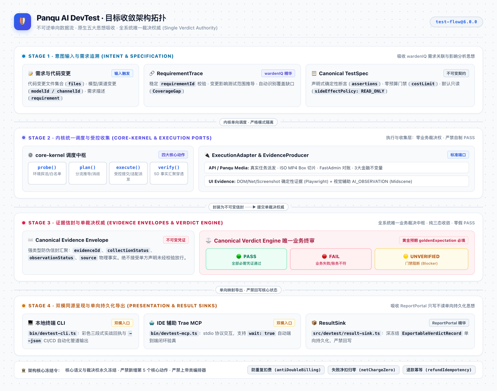
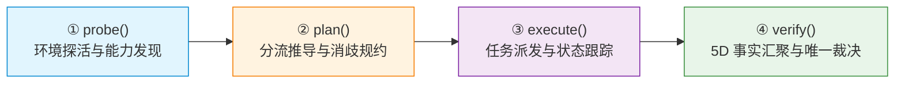
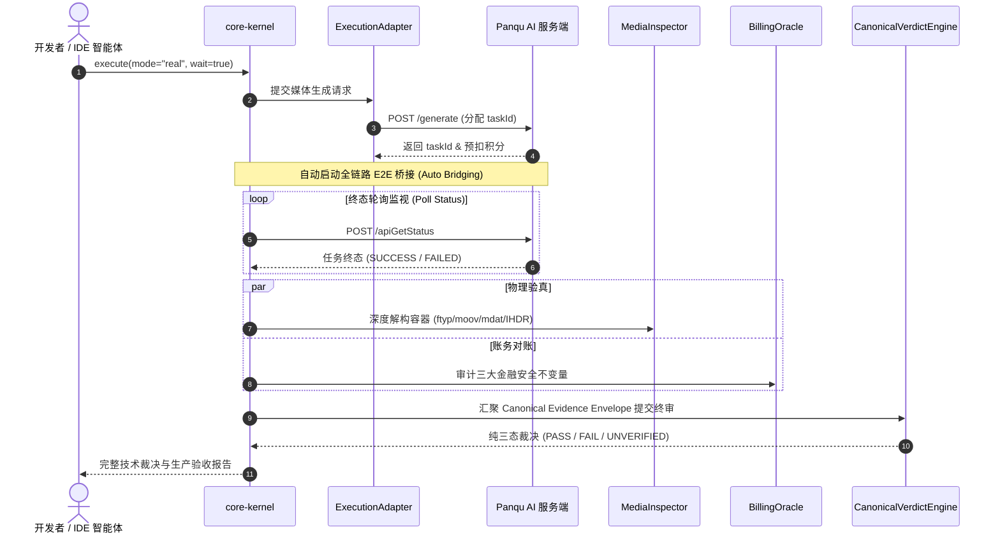
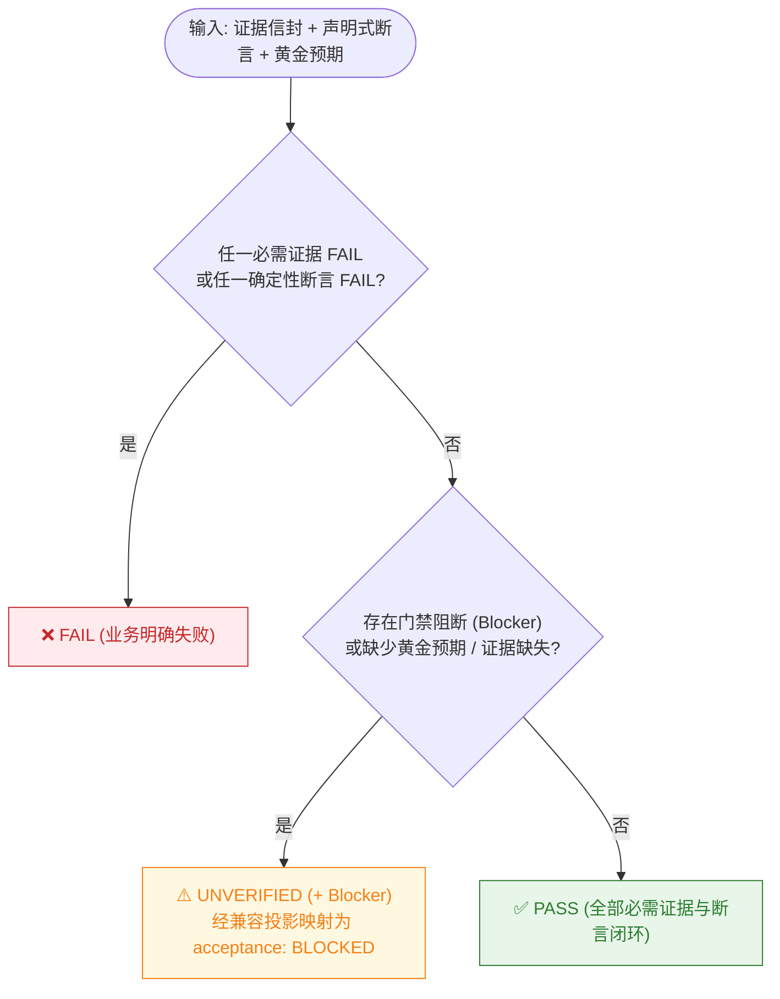

<div align="center">

# 🛡️ Panqu AI DevTest

**面向 Panqu AI 图片与视频生成链路的轻量纯净测试副驾、物理证据验真与自动化验收门禁框架**

[](package.json)
[-brightgreen.svg)](tests/unit/devtest)
[-brightgreen.svg)](vitest.config.ts)
[](package.json)
[](package.json)
[](docs/ARCHITECTURE_FREEZE.md)
[](docs/MCP_GUIDE.md)

</div>

---

## 📖 核心定位：只测不跑

Panqu AI DevTest 是轻量、纯净、无副作用的测试工程副驾。它负责**测试意图编排、多维物理证据链验真与全链路验收闭环**，坚决**不承载模型训练与推理服务本身**。

> **业务原则：代码与需求变更 ➔ 测试副驾意图编排 ➔ 物理证据与真实对账 ➔ 确定性门禁裁决 (零副作用 · 零假 PASS)**

> [!IMPORTANT]
> **全系统唯一最终裁决权威**：全链路业务裁决统一收敛至 `CanonicalVerdictEngine` 纯三态（`PASS` | `FAIL` | `UNVERIFIED`）。任何领域支撑模块、执行适配器、CLI 或 MCP 均无权自制业务通过裁决。

---

## 🏛️ 全景架构拓扑 (Converged Architecture)

<div align="center">



</div>


| 环节 / 模块 | 核心职责与吸收理念 | 详细技术规约 |
|---|---|---|
| **需求追溯与影响分析** | 关联需求稳定 ID、推导影响用例范围与覆盖缺口（吸收 **wardenIQ** 精华） | [`src/devtest/requirement-trace.ts`](src/devtest/requirement-trace.ts) |
| **规范测试规约** | 声明式确定性断言、`costLimit`、`sideEffectPolicy` 强类型规约 | [`src/devtest/canonical-protocol.ts`](src/devtest/canonical-protocol.ts) |
| **核心内核调度** | 单向驱动 `probe` / `plan` / `execute` / `verify`，支持 `executeCanonical` | [`src/devtest/core-kernel.ts`](src/devtest/core-kernel.ts) |
| **执行适配与 UI 证据** | DOM、网络拦截、物理截图（**Playwright**）与视觉辅助（**Midscene**） | [`src/devtest/ui-adapters.ts`](src/devtest/ui-adapters.ts) · [详细规约](docs/VERIFICATION_SPEC.md) |
| **唯一裁决引擎** | 纯三态裁决，门禁阻断严格表示为 `UNVERIFIED + blocker`，零假 PASS | [`src/devtest/canonical-verdict-engine.ts`](src/devtest/canonical-verdict-engine.ts) |
| **多端交付与持久化** | 本地终端、IDE 智能体双模同源呈现；深冻结结果单向导出（**ReportPortal**） | [`src/devtest/result-sink.ts`](src/devtest/result-sink.ts) · [MCP 指南](docs/MCP_GUIDE.md) |

---

## 🔄 四大核心动作闭环链路



- **`probe()`**：环境可用性连通、脱敏凭证有效性感知与模型白名单探测。无业务裁决权。[查看细节 ➔](docs/ARCHITECTURE_FREEZE.md#probe)
- **`plan()`**：Direct 直连与 NewAPI 分流决策、目标对象消歧、刊例积分预算（标为 `DEVTEST_EXPECTATION`）。无业务裁决权。[查看细节 ➔](docs/ARCHITECTURE_FREEZE.md#plan)
- **`execute()`**：受控离线仿真（`mock`）与真实环境提交（`real`）。支持注入标准 `ExecutionAdapter`。[查看细节 ➔](docs/ARCHITECTURE_FREEZE.md#execute)
- **`verify()`**：采集 5 维客观事实（Task 终态、产物归属、容器物理结构、账单流水、金融不变量），提交唯一裁决引擎终审。[查看细节 ➔](docs/ARCHITECTURE_FREEZE.md#verify)

---

## ⚡ E2E 自动连续闭环 (--wait 与 wait: true)

使用 `--wait`（CLI）或 `wait: true`（MCP），执行动作自动桥接至验真阶段，一键获得全维生产验收结论：



---

## ⚖️ 零假 PASS 裁决决策流

全系统遵循确定性 Fail-Closed 原则，绝不因为希望绿色而降低验证标准：



> [!CAUTION]
> **黄金预期必填红线 (Mandatory Golden Expectation)**：测试规范中的 `goldenExpectation` 必须显式必填，严禁从 legacy 结果或当前 verify 结果反推。缺少黄金预期直接判定失败。

---

## 🚀 快速上手 (Quick Start)

### 1. 本地终端 CLI 三步上手

```bash
# ① 环境探活
npm run devtest -- probe --env test --mock

# ② 动态规划与分流推导 (视频模型 84, 720p, 4s)
npm run devtest -- plan --model 84 --media video --resolution 720p --duration 4

# ③ 一键派发并自动闭环验真 (--wait)
npm run devtest -- execute --model 84 --media video --mode mock --wait
```

详细命令行参数与纯净 JSON 管道用法，请参阅 ➔ [**命令行参考手册 (CLI Reference)**](docs/CLI_REFERENCE.md)。

---

### 2. IDE 辅助智能体 (Trae / Cursor MCP)

DevTest 原生提供符合 Model Context Protocol 标准的 stdio 接口。在项目工作区 `.trae/mcp.json` 中配置：

```json
{
  "mcpServers": {
    "devtest": {
      "command": "node",
      "args": ["${workspaceFolder}/dist/bin/devtest-mcp.js", "--project-root", "${workspaceFolder}"],
      "env": { "NODE_OPTIONS": "", "NODE_USE_ENV_PROXY": "1" }
    }
  }
}
```

智能体直接发起一次调用即可自主跑完全链路：
```json
{
  "action": "execute",
  "model_id": 84,
  "media_type": "video",
  "mode": "real",
  "wait": true
}
```

详细 MCP 协议规范与环境配置，请参阅 ➔ [**MCP 集成指南**](docs/MCP_GUIDE.md)。

---

## 🧪 质量门禁与测试矩阵 (100% PASS)

```bash
# 运行全量 38 个套件、677 项单元测试
npm test

# 运行覆盖率门禁 (Lines/Statements/Functions >= 80%, Branches >= 70%)
npx vitest run --coverage

# 生产级 TypeScript 编译与内置技能同步
npm run build
```

<details>
<summary><b>📊 点击展开查看 38 个测试套件明细 (677 项测试全部通过)</b></summary>

| 测试文件 | 测试用例数 | 状态 | 核心验证范围 |
|---|---|---|---|
| `tests/unit/devtest/core-kernel-and-cli.test.ts` | 72 tests | ✅ PASS | 四大动作调度、CLI 退出码与 E2E 闭环状态机 |
| `tests/unit/devtest/architecture-convergence.test.ts` | 63 tests | ✅ PASS | 目标架构拓扑收敛性与单向调用链路穿透 |
| `tests/unit/devtest/routing-disambiguation.test.ts` | 51 tests | ✅ PASS | 模型与网关渠道消歧及防伪造门禁 |
| `tests/unit/devtest/dynamic-plan.test.ts` | 47 tests | ✅ PASS | 动态规划、定价刊例计算与风险失效规约 |
| `tests/unit/devtest/media-flow.test.ts` | 42 tests | ✅ PASS | 媒体长链路轮询、指数退避与网络抖动容忍 |
| `tests/unit/devtest/canonical-shadow-comparison.test.ts` | 30 tests | ✅ PASS | Canonical 唯一裁决引擎影子对比一致性 |
| `tests/unit/devtest/canonical-protocol.test.ts` | 25 tests | ✅ PASS | Canonical TestSpec 与证据信封强类型校验 |
| `tests/unit/devtest/capability-maturity-and-reality.test.ts` | 24 tests | ✅ PASS | 能力成熟度等级评估、现实验证与能力边界门禁 |
| `tests/unit/devtest/ui-adapter-contract-poc.test.ts` | 23 tests | ✅ PASS | Playwright / Midscene 规范适配器契约与切片尺寸提取 |
| `tests/unit/devtest/canonical-verdict-engine.test.ts` | 22 tests | ✅ PASS | 纯三态确定性断言算法与门禁阻断逻辑 |
| `tests/unit/devtest/mcp-high-level-tools.test.ts` | 22 tests | ✅ PASS | MCP stdio JSON-RPC 通讯协议与 Schema |
| `tests/unit/devtest/legacy-protocol-mappers.test.ts` | 20 tests | ✅ PASS | 兼容投影层双向映射一致性与单向投影 |
| `tests/unit/devtest/agent-evaluation.test.ts` | 16 tests | ✅ PASS | 智能体可信度离线评测引擎 (8 维漏洞检测) |
| `tests/unit/devtest/routing.test.ts` | 15 tests | ✅ PASS | 业务路由分流策略 (Direct / NewAPI) |
| `tests/unit/devtest/billing.test.ts` | 14 tests | ✅ PASS | 真实账务对账与三大金融安全不变量审计 |
| `tests/unit/devtest/self-evolving-tester.test.ts` | 13 tests | ✅ PASS | 业务知识自演化测试器契约 |
| `tests/unit/devtest/domain-knowledge.test.ts` | 12 tests | ✅ PASS | 领域知识库召回与失效模式识别 |
| `tests/unit/devtest/core-kernel-canonical-switch.test.ts` | 10 tests | ✅ PASS | 唯一裁决引擎切换 10 大安全反证门禁 |
| `tests/unit/devtest/execution-ports.test.ts` | 10 tests | ✅ PASS | 标准受控执行端口与证据生产者端口校验 |
| `tests/unit/devtest/knowledge-sync-payload.test.ts` | 10 tests | ✅ PASS | 知识同步载荷与跨环境同步一致性 |
| `tests/unit/devtest/mcp-candidate-record.test.ts` | 10 tests | ✅ PASS | 知识候选缓冲池受控写入与待审状态 |
| `tests/unit/devtest/media-inspector.test.ts` | 10 tests | ✅ PASS | MP4 ISO-14496 容器与尾部 moov 范围解析 |
| `tests/unit/devtest/knowledge-decoupling.test.ts` | 9 tests | ✅ PASS | 知识资产解耦架构合规性 |
| `tests/unit/devtest/knowledge-promotion.test.ts` | 9 tests | ✅ PASS | 候选知识审核晋升流程 |
| `tests/unit/devtest/result-sink.test.ts` | 7 tests | ✅ PASS | 单向结果持久化导出契约 (深冻结记录) |
| `tests/unit/devtest/requirement-trace.test.ts` | 6 tests | ✅ PASS | 需求关联双向索引构建与影响分析矩阵 |
| 探索与变异专项测试 (6 个套件) | 31 tests | ✅ PASS | 状态转移、学习沉淀、变异算子与生产循环审计 |
| 其他专项契约测试 (2 个套件) | 7 tests | ✅ PASS | 环境探活与 Trae 技能规约契约 |
| `tests/unit/devtest/verify-input-contract-alignment.test.ts` | 17 tests | ✅ PASS | Verify 入参对齐、参数校验与归一化门禁 |
| `tests/unit/devtest/dependency-cycle.test.ts` | 16 tests | ✅ PASS | 模块依赖无环检测与分层单向引用门禁 |
| `tests/unit/devtest/public-api-contract.test.ts` | 5 tests | ✅ PASS | 公共导出 API 契约与版本稳定性校验 |
| `tests/unit/devtest/test-isolation.test.ts` | 9 tests | ✅ PASS | 全局状态隔离恢复、未捕获断言异常还原与框架级故障恢复 |
| **全量总计** | **677 tests 全部通过** | **100% PASS** | **零跳过 · 零失败** |

</details>

---

## 📚 深度文档中心 (Documentation Hub)

所有复杂规约与详细技术手册均已拆分至专属文档，保持根目录 README 简洁精炼：

- 📐 [**架构永久冻结规范 (ARCHITECTURE_FREEZE.md)**](docs/ARCHITECTURE_FREEZE.md) — 系统核心拓扑、受控扩展红线与不可变原则
- 💻 [**命令行参考手册 (CLI Reference)**](docs/CLI_REFERENCE.md) — 本地终端四大动作完整参数、示例与 JSON 管道
- 🤖 [**MCP 智能体集成指南 (MCP Guide)**](docs/MCP_GUIDE.md) — Trae / Cursor 配置、工具参数与闭环交互最佳实践
- 🔍 [**验真与金融对账白皮书 (Verification Spec)**](docs/VERIFICATION_SPEC.md) — MP4 Box 解构、尾部切片、三大金融不变量及会话优先级
