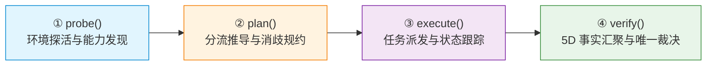
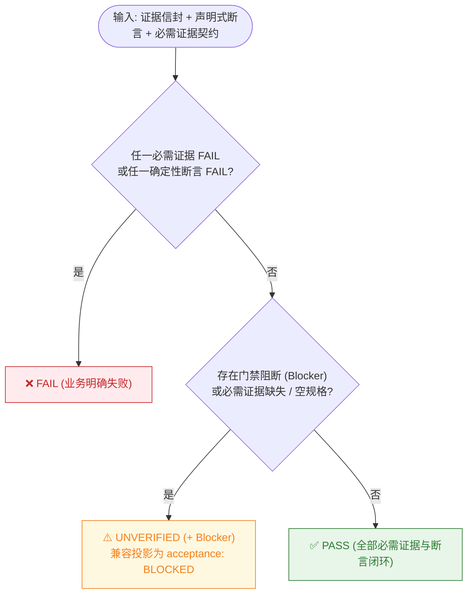

<div align="center">

# 🛡️ Panqu AI DevTest

**面向 Panqu AI 图片 / 视频生成链路的测试工程副驾 —— 意图编排、物理证据验真、零假 PASS 确定性验收门禁**

[](package.json)
[-brightgreen.svg)](tests/unit/devtest)
[-brightgreen.svg)](vitest.config.ts)
[](.github/workflows/ci.yml)
[](package.json)
[](package.json)
[-purple.svg)](docs/ARCHITECTURE_FREEZE.md)
[](docs/CLI_REFERENCE.md)

</div>

---

## 📖 定位：只测不跑 · 零假 PASS

Panqu AI DevTest 是轻量、纯净、无副作用的测试工程副驾。它负责**测试意图编排、多维物理证据链验真与全链路验收闭环**，**不承载模型训练与推理服务本身**。

> **业务原则：代码/需求变更 ➔ 意图编排 ➔ 物理证据与真实对账 ➔ 确定性门禁裁决（零副作用 · 零假 PASS）**

> [!IMPORTANT]
> **全系统唯一裁决权威**：全链路业务裁决统一收敛至 `CanonicalVerdictEngine` 纯三态（`PASS` \| `FAIL` \| `UNVERIFIED`）。任何领域模块、执行适配器、CLI 或 MCP 均无权自制业务通过裁决。

---

## 🚀 快速上手（本地优先 · 任意智能体可用）

DevTest 的核心接口是一个 **agent 无关的本地 CLI**（`probe`/`plan`/`execute`/`verify`）。本地终端、Codex 等编码智能体、Trae MCP 都调用同一个 `core-kernel`，**Trae MCP 只是同源包装，可选**。

### ① 本地终端 CLI（主入口）

```bash
npm install && npm run build

# 环境探活（--mock 为离线仿真，输出会标注 [MOCK]）
npm run devtest -- probe --env test --mock

# 分流推导与测试规划（视频模型 84, 720p, 4s）
npm run devtest -- plan --model 84 --media video --resolution 720p --duration 4

# 一键派发并自动闭环验真（--wait；--no-db-verify 可跳过数据库取证）
npm run devtest -- execute --model 84 --media video --mode mock --wait
```

详见 ➔ [**命令行参考手册 (CLI Reference)**](docs/CLI_REFERENCE.md)。

### ② 任意编码智能体 / Codex（agent 无关）

任何能读 `AGENTS.md` 并执行 shell 的智能体都能直接驱动 DevTest —— 无需任何专属插件：

- **执行**：直接跑上面的 `npm run devtest -- <动作>`；
- **知识**：读版本库内的技能文档（源在 `src/devtest/assets/`，随构建打包进 `dist/`，见下方「内置技能库」）。

> 让某个智能体用某能力，只需在其 `AGENTS.md` 写清「做 X 时读某技能 / 跑某命令」。文件与命令均在版本库内、可离线使用。

### ③ Trae / Cursor MCP（可选 · 同源包装）

DevTest 附带符合 MCP 标准的 stdio 接口，是对同一 `core-kernel` 的薄包装。在 `.trae/mcp.json` 配置：

```json
{
  "mcpServers": {
    "devtest": {
      "command": "node",
      "args": ["${workspaceFolder}/dist/bin/devtest-mcp.js", "--project-root", "${workspaceFolder}"],
      "env": { "NODE_OPTIONS": "", "NODE_USE_ENV_PROXY": "1" }
    }
  }
}
```

详见 ➔ [**MCP 集成指南**](docs/MCP_GUIDE.md)。

---

## 🔄 四大核心动作闭环



- **`probe()`**：环境连通、脱敏凭证有效性感知与模型白名单探测。无裁决权。（`--mock` 为离线仿真，人读报告标注 `[MOCK]`）
- **`plan()`**：Direct 直连 vs NewAPI 分流决策、目标对象消歧、刊例积分预算（标为 `DEVTEST_EXPECTATION`）。无裁决权。
- **`execute()`**：受控离线仿真（`mock`）与真实提交（`real`）。真实提交默认 `READ_ONLY` 预检阻断，需显式 `--allow-submit` / `--allow-paid` 授权。
- **`verify()`**：采集 5 维客观事实（Task 终态、产物归属、容器物理结构、账单流水、金融不变量），提交唯一裁决引擎终审。使用 `--wait` 可从 `execute` 自动桥接至 `verify` 一键闭环。

---

## ⚖️ 零假 PASS 裁决（确定性 Fail-Closed）



> [!CAUTION]
> **最小证据契约红线**：TestSpec 必须至少声明 `requiredEvidence` 或 `deterministicAssertions` 之一；两者皆空时裁决引擎直接返回 `UNVERIFIED`（blocker `NO_EVALUABLE_EVIDENCE_SPEC`），严禁"空规格 PASS"。证据 provenance 严禁从预期值反推（`PROVENANCE_DERIVED_FROM_EXPECTATION` 门禁）。

---

## 🗄️ 真实数据库物理取证（已接入 verify）

涉及真实任务派发与账目变动的场景，`verify` 在**真实模式**下会自动经 `DatabaseEvidenceProducer` 通过 SSH 隧道对测试库做**只读**物理落库取证（`pq_aivideo_new` / `pq_volcengine_ai_task` / `pq_score_log` 等），并将证据折算进唯一裁决：

- **严格只读**（仅 `SELECT`），凭据读取自 gitignore 的 `db-credentials.json`，绝不硬编码；
- **失败关闭**：库不可达 / 记录缺失 / 流水不一致 → `UNVERIFIED` / `BLOCKED`，绝不凭 HTTP 200 假 PASS；
- **快速失败**：SSH 8s、DB 取证独立 10s 超时（不随 `--poll-timeout` 放大），避免卡死；
- **边界**：单元测试（VITEST）不触发真实连库；真实运行可用 `--no-db-verify` 显式跳过；亦提供独立手动脚本 `python3 scripts/test-db-connection.py`。

> 渠道权重挑选与 NewAPI→火山自动兜底运行在网关侧 Go 消费者（不在本仓库）；DevTest 覆盖主站侧「决策 / 落库 / 回读」全链路。

---

## 🧩 内置技能库（Skills · agent 无关）

技能是给智能体的**领域决策指南 + 代码取证映射**，源在 `src/devtest/assets/<name>/`，构建时同步到 `dist/` 与 `.trae/skills/`，本地 CLI、Codex、Trae 共用：

| 技能 | 覆盖场景 |
|---|---|
| `panqu-newapi-diversion` | NewAPI 两级分流决策、渠道权重与降级回退（含 [`diversion-flow.md`](src/devtest/assets/panqu-newapi-diversion/references/diversion-flow.md) 真实代码端到端流程，带 `文件:行号` 取证） |
| `panqu-video-models` / `panqu-image-models` | 视频 / 图片模型接入、能力参数、任务与结果 |
| `panqu-billing` | 计费扣费、积分预估、账单大盘与对账 |
| `panqu-newapi-model-onboarding` | NewAPI 新模型接入 SOP 与排障 |
| `panqu-canvas` | 画布、工作流节点、协作与执行 |
| `devtest` | DevTest 主技能：需求澄清、计划一次确认、证据门禁 |

---

## 🏛️ 架构拓扑（收敛式单裁决引擎）

| 环节 / 模块 | 核心职责 | 源码 |
|---|---|---|
| **需求追溯与影响分析** | 关联需求稳定 ID、推导影响用例与覆盖缺口 | [`requirement-trace.ts`](src/devtest/requirement-trace.ts) |
| **规范测试规约** | 声明式确定性断言、`costLimit`、`sideEffectPolicy` 强类型 | [`canonical-protocol.ts`](src/devtest/canonical-protocol.ts) |
| **核心内核调度** | 单向驱动 `probe`/`plan`/`execute`/`verify` | [`core-kernel.ts`](src/devtest/core-kernel.ts) |
| **执行适配与 UI 证据** | 工具无关的 DOM/网络/截图/视觉**事实契约**；**不内置 Playwright/Midscene 驱动**，需调用方注入 Producer（视觉结果恒为 `AI_OBSERVATION`，绝不单独产 PASS） | [`ui-adapters.ts`](src/devtest/ui-adapters.ts) |
| **数据库物理取证** | 真实模式下只读 SSH 落库取证，失败关闭 | [`database-evidence-producer.ts`](src/devtest/database-evidence-producer.ts) |
| **唯一裁决引擎** | 纯三态裁决，门禁阻断表示为 `UNVERIFIED + blocker`，零假 PASS | [`canonical-verdict-engine.ts`](src/devtest/canonical-verdict-engine.ts) |
| **多端交付与持久化** | 双模同源呈现；深冻结结果单向导出 | [`result-sink.ts`](src/devtest/result-sink.ts) |

---

## 🛡️ 五重自动化安全门禁 (GitHub Actions)

| 安全层级 / Job | 扫描工具 | 目标 |
|---|---|---|
| **1. 生产依赖审计** (`security-audit`) | `npm audit --audit-level=high` | 阻断 High / Critical CVE 生产依赖 |
| **2. SAST 静态分析** (`security-sast`) | **Semgrep** (OWASP Top 10 & CWE) | 阻断注入、反序列化、不安全路径与敏感 API 误用 |
| **3. 秘钥与凭证防泄漏** (`security-secrets`) | **Gitleaks** (全历史) | 阻断 JWT / API Key / SSH 私钥 / 明文密码入库 |
| **4. 配置与容器安全** (`security-trivy`) | **Trivy** | 阻断畸变容器配置与云原生隐患 |
| **5. 开源协议合规** (`security-license`) | 自研合规审计器 | 阻断未授权传染性协议 (GPL/AGPL) 污染 |

---

## 🧪 质量门禁与测试矩阵

```bash
npm test                      # 全量 40 套件 / 715 单元测试
npx vitest run --coverage     # 覆盖率门禁 (Statements/Lines/Functions ≥ 80%, Branches ≥ 70%)
npm run build                 # TypeScript 编译 + 内置技能同步 (dist/ 与 .trae/skills/)
npm run lint                  # ESLint + Prettier
```

当前状态：**40 套件 / 715 用例 100% 通过，零跳过零失败**；覆盖率 语句 86.4% / 行 87.15% / 分支 78.8% / 函数 91.07%（过门禁）。

<details>
<summary><b>📊 测试矩阵（按验证域）</b></summary>

| 验证域 | 代表套件 | 核心验证范围 |
|---|---|---|
| **核心调度 / CLI** | `core-kernel-and-cli`、`core-kernel-canonical-switch` | 四大动作、CLI 退出码、E2E 闭环状态机、10 大安全反证 |
| **唯一裁决** | `canonical-verdict-engine`、`canonical-protocol`、`canonical-shadow-comparison`、`legacy-protocol-mappers` | 纯三态断言、最小证据契约底线、证据信封校验、单向投影 |
| **分流路由** | `routing`、`routing-disambiguation`、`dynamic-plan` | Direct/NewAPI 决策、渠道消歧防伪、动态规划与刊例计算 |
| **执行 / 媒体 / 账务** | `execution-ports`、`media-flow`、`media-inspector`、`billing`、`database-evidence-producer` | 受控执行端口、轮询退避、MP4/PNG 物理解析、三大金融不变量、DB 只读取证 |
| **需求 / 知识 / 能力** | `requirement-trace`、`domain-knowledge`、`knowledge-*`、`self-evolving-tester`、`capability-maturity-and-reality`、`agent-evaluation` | 需求追溯、知识召回/晋升/解耦、能力成熟度、智能体可信度评测 |
| **架构 / 契约 / 隔离 / 安全** | `architecture-convergence`、`dependency-cycle`、`public-api-contract`、`test-isolation`、`result-sink`、`security-ci`、探索变异 6 套件 | 拓扑收敛、无环依赖、API 契约、故障恢复、CI 安全门禁契约 |

</details>

---

## 📚 深度文档中心

- 📐 [**架构永久冻结规范**](docs/ARCHITECTURE_FREEZE.md) — 核心拓扑、受控扩展红线与不可变原则
- 💻 [**命令行参考手册**](docs/CLI_REFERENCE.md) — 四大动作完整参数、示例与 JSON 管道
- 🤖 [**MCP 集成指南**](docs/MCP_GUIDE.md) — Trae / Cursor 配置与闭环交互
- 🔍 [**验真与金融对账白皮书**](docs/VERIFICATION_SPEC.md) — MP4 Box 解构、尾部切片、三大金融不变量
- 🔀 [**NewAPI 分流真实代码流程**](src/devtest/assets/panqu-newapi-diversion/references/diversion-flow.md) — 主站分流端到端取证映射

